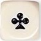
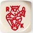
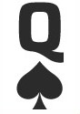
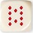
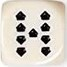

# Poker Dice Game

<h2>Le Poker d'as et ses règles</h2>
Le Poker d'as se joue avec 5 dés, les dés correspondent à des cartes
<table>
    <tr>
        <td class="rules"></td>
        <td class="rules"></td>
        <td class="rules"></td>
        <td class="rules"></td>
        <td class="rules"></td>
        <td class="rules"></td>
    </tr>
</table>
<h3>Les combinaisons</h3>
<ul>
    <li>05 pts : La <strong>Paire</strong> : deux dés identiques</li>
    <li>10 pts : La <strong>Double paire</strong> : deux paires</li>
    <li>15 pts : La <strong>Petite suite</strong> : 9, 10, Valet, Reine, Roi</li>
    <li>20 pts : Le <strong>Brelan</strong> : trois dés identiques</li>
    <li>25 pts : La <strong>Grande suite</strong> : 10, Valet, Reine, Roi, As</li>
    <li>30 pts : Le <strong>Full</strong> : Brelan + Paire</li>
    <li>35 pts : Le <strong>Carré</strong> : quatre dés identiques</li>
    <li>50 pts : Le <strong>Poker</strong> : cinq dés identiques</li>
</ul>

<h3>Informations générales</h3>
<ul>
    <li><strong>Nombre de dés : </strong>5</li>
    <li><strong>Nombre de tours : </strong>1</li>
    <li><strong>Nombre de lancers max : </strong>3</li>
</ul>
